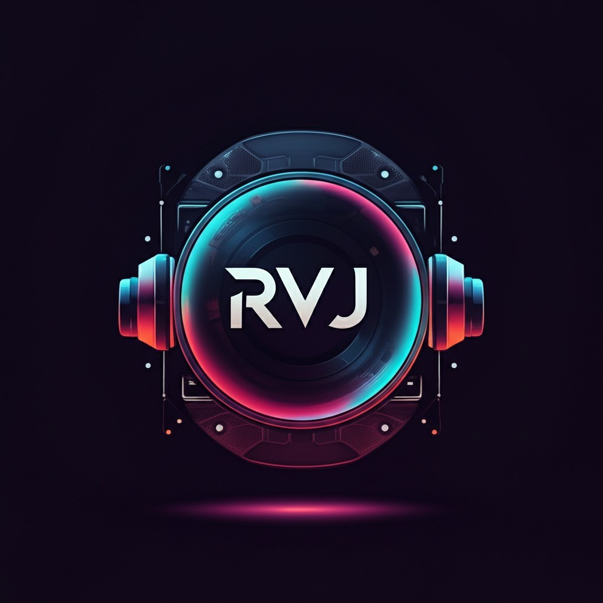

# rVJ - Professional Video Editor for VJs & Content Creators

<div align="center">



**A native Windows desktop application for creating synchronized audio-visual content**

[](https://github.com/RTSII/rVJ)
[](https://tauri.app)
[](https://www.typescriptlang.org/)
[](https://react.dev/)

</div>

---

## 🎯 Project Vision

rVJ is a **native Windows desktop video editor** designed specifically for VJs, music video creators, and content producers who need to:

- **Sync visuals to audio** with precise waveform-based timeline editing
- **Work with long-form content** (2+ hour DJ sets, live performances)
- **Access local files directly** without browser upload limitations
- **Export professional-quality videos** using native FFmpeg encoding

---

## ✨ Key Features

### 🎬 Video Editing
- **Dual-mode playback**: Audio-master mode (for DJ/VJ sync) and video-only mode
- **Drag-and-drop timeline** with clip trimming and reordering
- **Real-time preview** with seamless clip transitions
- **6 visual effects** including RGB shift, glitch, and blur

### 🎵 Audio Integration
- **Real waveform visualization** extracted from audio files
- **Audio-synced playback** where clips follow the master audio track
- **Beat marker support** for precise cut points

### 📁 Local File Access
- **Native Windows file dialogs** for browsing your PC
- **Direct file streaming** via Tauri's asset protocol (no memory bloat)
- **Fast thumbnail generation** using native FFmpeg

### 🎥 Export
- **Native FFmpeg encoding** for fast, high-quality exports
- **Save dialog** to choose your output location
- **Clip trimming and concatenation** with audio mixing

---

## 🚀 Getting Started

### Prerequisites

1. **Node.js 18+** - [Download](https://nodejs.org/)
2. **Rust toolchain** - [Install via rustup](https://rustup.rs/)
3. **Windows 10/11** (version 1803 or later)

### Installation

```powershell
# Clone the repository
git clone https://github.com/RTSII/rVJ.git
cd rVJ

# Install dependencies
npm install

# Ensure Rust is in your PATH (if just installed)
$env:Path += ";$env:USERPROFILE\.cargo\bin"
```

### Development Mode

```powershell
# Launch the desktop app in development mode
npm run tauri:dev
```

This will:
1. Start the Vite dev server (hot-reloading frontend)
2. Compile the Rust backend (first run takes ~2-3 minutes)
3. Open the native desktop window

### Production Build

```powershell
# Build the production executable
npm run tauri:build
```

The installer will be created in `src-tauri/target/release/bundle/`.

### Web-Only Mode (Browser Fallback)

```powershell
# Run in browser without desktop features
npm run dev
```

Note: Browser mode has limited functionality (no native file access, uses ffmpeg.wasm for export).

---

## 📁 Project Structure

```
rVJ/
├── src/                      # React/TypeScript frontend
│   ├── components/           # UI components
│   │   ├── MediaLibrary.tsx  # File upload with native dialogs
│   │   ├── Timeline.tsx      # Drag-drop timeline with export
│   │   └── VideoPreview.tsx  # Playback with buffer monitoring
│   ├── lib/
│   │   ├── desktop.ts        # Tauri utilities (dialogs, waveform)
│   │   ├── nativeExport.ts   # FFmpeg export bridge
│   │   └── store.ts          # Zustand state management
│   └── types/                # TypeScript definitions
├── src-tauri/                # Rust backend
│   ├── src/main.rs           # Tauri commands (export, thumbnail)
│   ├── bin/ffmpeg.exe        # Bundled FFmpeg binary
│   └── tauri.conf.json       # Tauri configuration
├── PROJECT-ROADMAP.md        # Detailed technical documentation
├── DESKTOP-TODO.md           # Conversion task tracking
└── package.json              # Scripts and dependencies
```

---

## 🛠️ Technology Stack

| Layer | Technology |
|-------|------------|
| **Desktop Framework** | Tauri 2.x (Rust backend, WebView2 frontend) |
| **Frontend** | React 18 + TypeScript + Vite |
| **UI Components** | shadcn/ui + Tailwind CSS |
| **State Management** | Zustand |
| **Video Export** | Native FFmpeg (desktop) / ffmpeg.wasm (web) |
| **File Access** | Tauri plugins (fs, dialog, shell) |

---

**Alpha Launch Successful** - The desktop conversion is functional with:
- ✅ **New rVJ Branding**: Custom logo integrated into app and installer
- ✅ **Native file dialogs** for video/audio selection
- ✅ **Real waveform generation** from audio files
- ✅ **Native FFmpeg thumbnail extraction**
- ✅ **Native FFmpeg video export**
- ✅ **Zero-buffering playback** via `asset://` protocol (2hr+ supported)
- ✅ **Full Tauri 2.0 Security Migration**: Verified capabilities/permissions

**Next Steps** (see `DESKTOP-TODO.md`):
- Deep testing with large project files
- Performance optimization (preloading)
- Recent files / favorites feature
- Windows installer packaging (NSIS)

---

## 🎮 Keyboard Shortcuts

| Key | Action |
|-----|--------|
| `Space` | Play / Pause |
| `J` | Jump back 10 seconds |
| `L` | Jump forward 5 seconds |
| `←` | Jump back 5 seconds |
| `→` | Jump forward 5 seconds |
| `Home` | Jump to start |
| `End` | Jump to end |

---

## 📝 Scripts Reference

```json
{
  "dev": "vite",              // Web-only development
  "build": "vite build",      // Web production build
  "tauri": "tauri",           // Tauri CLI
  "tauri:dev": "tauri dev",   // Desktop development
  "tauri:build": "tauri build" // Desktop production build
}
```

---

## 🤝 Contributing

This is a personal project by RTSII. Contributions, issues, and feature requests are welcome!

---

## 📄 License

This project is proprietary software. FFmpeg is bundled under LGPL license.

---

<div align="center">

**Built with ❤️ for the VJ community**

</div>
